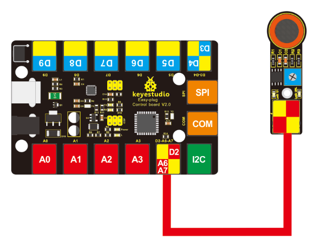

# KS0132 keyestudio EASY plug Analog Alcohol Sensor


## 1. Introduction

This analog gas sensor - MQ3 is suitable for detecting alcohol. It can be used in a Breath analyzer. Also it has high sensitivity to alcohol and low sensitivity to Benzine.

The sensitivity can be adjusted by a blue potentiometer on the sensor. This module should be used together with EASY plug control board.

**Special Note:**

The sensor/module is equipped with the RJ11 6P6C interface, compatible with our keyestudio EASY plug Control Board with RJ11 6P6C interface.

If you have the control board of other brands, it is also equipped with the RJ11 6P6C interface but has different internal line sequence, can’t be used compatibly with our sensor/module.

## 2. Specification

- Connector: Easy plug
- Power supply: 5V
- Sensor type: Digital and Analog
- Simple drive circuit
- Stable and long service life
- Quick response and High sensitivity

## 3. Technical Details

- Dimensions: 56mm * 20mm * 18mm
- Weight: 7.5g

## 4. Connect It Up

Connect the EASY Plug analog alcohol sensor to control board using an RJ11 cable. Then connect the control board to your PC with a USB cable.



## 5. Upload the Code

Download code: [Code](./Code.7z)

```c
int gas_din=2;
int gas_ain=A7;
int led=13;
int ad_value;

void setup()
{
  pinMode(led,OUTPUT);
  pinMode(gas_din,INPUT);
  pinMode(gas_ain,INPUT);
  Serial.begin(9600);
}

void loop()
{ 
  ad_value=analogRead(gas_ain);
  if(digitalRead(gas_din)==LOW)
  { 
    digitalWrite(led,HIGH);
    Serial.println("Alcohol leakage ");
    Serial.println(ad_value);
  }
  else
  {
    digitalWrite(led,LOW);
	Serial.println("Alcohol not leak");
	Serial.println(ad_value);
  }
  delay(500);
}
```

## 6. Result

Done uploading the code, open the serial monitor and set the baud rate to 9600. If the sensor detects the alcohol in the air, you should see the value change.

